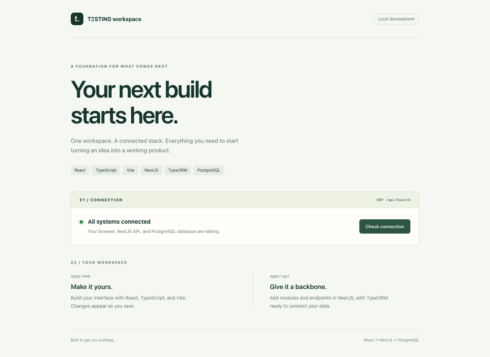

# TΞSTING

A TypeScript workspace for the TΞSTING hackathon team, with a React web app and a database-connected API.

The current app checks the connection from the browser through the API to PostgreSQL. It provides a shared foundation for the team's product work, with loading, success, and retry states.



## Run locally

Requires Docker with Compose v2. From the repository root:

```sh
cp .env.example .env
# Set your local database password in .env before starting.
docker compose up --build --wait --wait-timeout 180
```

Open [localhost:5173](http://localhost:5173) and select **Check connection**. The API runs at [localhost:3000](http://localhost:3000).

To stop the stack, run `docker compose down`; database data is preserved. This setup uses development servers. No public demo is deployed yet.

For Node development, custom ports, troubleshooting, and database migrations, see the [development guide](docs/DEVELOPMENT.md).

## Check your changes

With Node.js 24.11+ in the 24.x line and npm 10:

```sh
npm ci
npm run check
```

This runs linting, formatting checks, type checking, unit tests with 100% line and branch coverage requirements, and builds. CI also checks the running Docker stack.

## Stack and structure

React + Vite → NestJS API → TypeORM → PostgreSQL, using TypeScript throughout.

- `apps/web` — web interface.
- `apps/api` — API, database connection, and migration tooling.
- Root — shared npm workspaces, tests, Docker Compose, and CI.

## More

- [Build story](BUILD_STORY.md) — progress, decisions, and the city simulator direction.
- [Development guide](docs/DEVELOPMENT.md) — setup, commands, architecture details, and migrations.
- [External tools and agent skills](docs/EXTERNAL_TOOLS.md) — sources, attribution, and usage.
