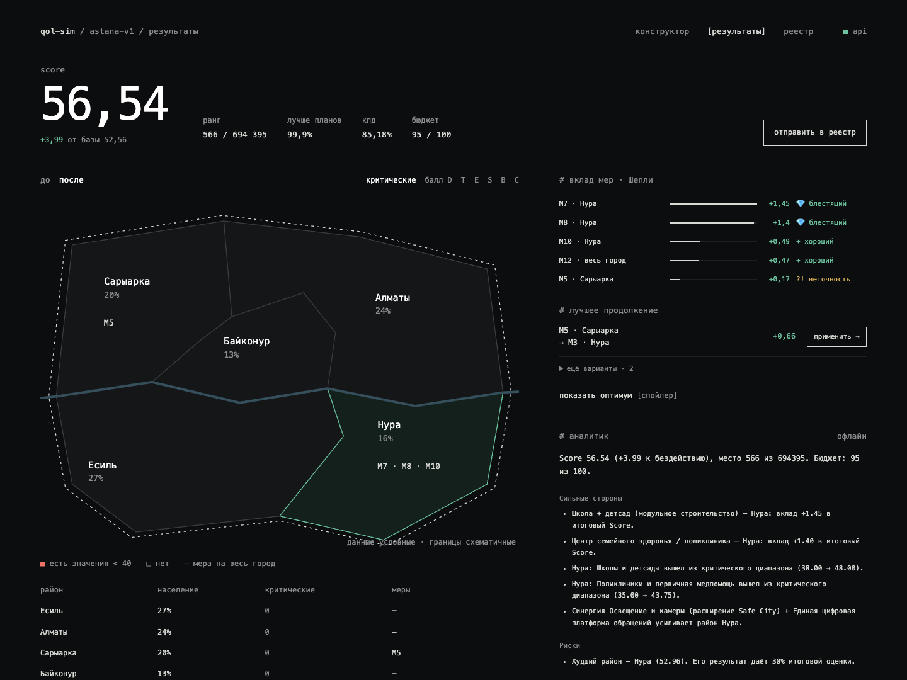
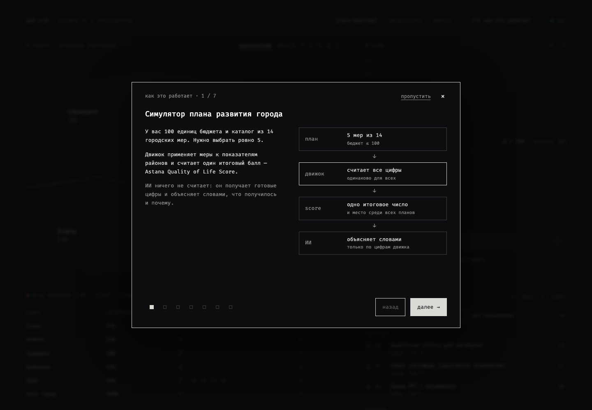
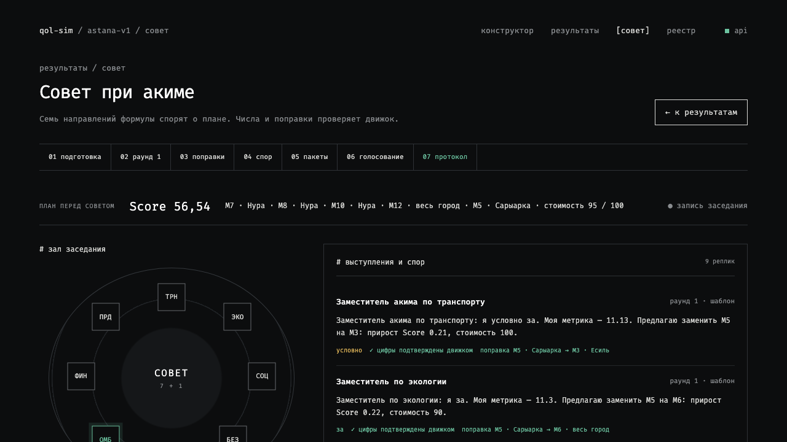

# QOL-SIM — Разбор партии

AI-симулятор акима для команд, городских аналитиков и всех, кто хочет проверить последствия городских решений.

При ограниченном бюджете полезная инициатива не обязательно делает весь город лучше. QOL-SIM позволяет выбрать **ровно пять мер из 14** для пяти условных районов Астаны, затем разбирает план как шахматную партию: считает Astana Quality of Life Score, вклад каждого решения, место среди всех допустимых планов и лучшие замены. Аналитик объясняет результат и компромиссы на основе расчётов движка.



Публичное демо не развёрнуто. Локальное приложение: [localhost:5173](http://localhost:5173). [История разработки](BUILD_STORY.md), [исходный датасет](docs/data/astana-dataset.md), [план реализации](docs/superpowers/plans/2026-09-23-plan-review-simulator.md), [внешние инструменты](docs/EXTERNAL_TOOLS.md).

## Запуск за одну команду

Нужен Docker с Compose v2. В корне репозитория:

```sh
cp .env.example .env
docker compose up --build --wait --wait-timeout 180
```

Откройте [localhost:5173](http://localhost:5173). API: [localhost:3000/api/scenario](http://localhost:3000/api/scenario). При старте API применяет миграции и один раз перебирает пространство планов. PostgreSQL хранит реестр команд и историю заседаний; данные сценария версионированы в коде.

**Ключ AI не нужен для основного сценария.** С пустым `OPENAI_API_KEY` работают детерминированный офлайн-аналитик и полное заседание совета. При ошибке провайдера, таймауте или некорректном ответе приложение использует шаблон для затронутого ответа и явно показывает его источник.

```sh
npm run smoke           # Проверка работающего стека; нужен локальный Node
# Та же проверка без локального Node:
docker compose exec -T web node scripts/smoke.mjs http://localhost:5173 http://api:3000
docker compose logs -f
docker compose down     # Останавливает сервисы, сохраняет данные PostgreSQL
```

Compose использует проект `testing-workspace`, привязывает порты к localhost и сохраняет базу в именованном томе. Это окружение разработки с hot reload. После изменения зависимостей или переменных окружения пересоберите контейнеры. Пароль в примере предназначен только для локальной разработки; смена `.env` не меняет пароль уже созданной базы.

Для DigitalOcean App Platform запускайте миграции отдельным pre-deploy Job и задайте `POSTGRES_CA_CERT` для проверяемого TLS-соединения с Managed PostgreSQL. [Настройка и команды](docs/DEVELOPMENT.md#digitalocean-app-platform).

## Демо за две минуты

При первом открытии появляется обучение **«как это работает»**. Пройдите семь шагов или нажмите **«пропустить»**, чтобы перейти к конструктору.

1. В конструкторе посмотрите Нуру: школы **38**, медицина **35**, оба значения критические.
2. Загрузите **план-ловушку** и разберите его: **52.45**, ниже бездействия **52.56**, хотя потрачено **86**. Безопасные переходы в Алматы понижают T1 до **38.25** и вызывают новый штраф.
3. Загрузите **сильный пример**: школа и поликлиника в Нуре, освещение и камеры в Нуре, цифровая платформа по городу, чистое топливо в Сарыарке. Бюджет **95**, Score **56.54**, место **566 из 694 395**.
4. Примените предложенную замену **M5 в Сарыарке → M3 в Нуре**: Score **57.21**. Можно раскрыть глобальный оптимум **57.24**.
5. Прочитайте сильные стороны, риски, последствия и рекомендации. Журнал инструментов показывает вызовы движка, их входы и результаты.
6. Отправьте план с названием команды в реестр. В таблице остаётся лучший результат каждой команды; Score и ранг сервер рассчитывает заново.

## Обучение «как это работает»



Семь шагов объясняют бюджет и выбор мер, районы и провалы, правила плана, лаг, итоговый балл, положительный и отрицательный примеры и экран результатов. Лаг можно переключать от 0 до 4: меняются восемь кварталов на шкале и учебный эффект школы. В примерах переключаются школа в Нуре и переходы в Алматы, а в последнем шаге раскрываются термины — процентиль, КПД, вклад и оценка меры, синергия.

Кнопки «назад / далее» и точки переключают шаги. «Пропустить», ×, Escape и «собрать план →» закрывают обучение. Ссылка **[?] как это работает** в шапке возвращает к нему с первого шага, сохраняя текущий план. Закрытие запоминается в этом браузере (`localStorage`); если хранилище недоступно, приложение продолжает работать, но обучение появится снова после перезагрузки. Диалог поддерживает клавиатуру, возвращает фокус к кнопке открытия и адаптируется к мобильному экрану.

Числа в обучении — примеры сценария `astana-v1`, а не предварительный расчёт выбранного плана. Прирост сильного примера показан как **+3.99**, в соответствии с движком и его округлением. Учебный переключатель лага не меняет каталог и план.

## Совет при акиме

Из готового разбора нажмите **«вынести на совет»**, затем **«начать заседание»**. Семь вымышленных участников обсуждают план, предлагают допустимые замены и голосуют по проверенной рекомендации председателя. Это учебные персонажи, только должности; данные синтетические.



| Участник            | Слагаемое и метрика                                         |
| ------------------- | ----------------------------------------------------------- |
| Транспорт           | T1, T2 · вес 0.20; взвешенный вклад в средний балл города   |
| Экология            | E1, E2 · 0.20; тот же вклад                                 |
| Социальная сфера    | S1, S2 · 0.22; тот же вклад                                 |
| Безопасность        | B1, B2 · 0.18; тот же вклад                                 |
| Городское хозяйство | C1, C2 · 0.20; тот же вклад                                 |
| Омбудсмен           | Худший район минус число критических значений               |
| Финансы             | Прирост Score относительно бездействия на 10 единиц бюджета |
| Председатель        | Итоговый Score, допустимость и цена компромиссов            |

Сумма пяти вкладов направлений равна среднему баллу города. Движок определяет позиции, до трёх кандидатов каждому участнику, последствия замен, возражения и голоса. LLM пишет реплики; числа и ID проверяются по разрешённым фактам. Проверка числовых литералов не доказывает семантическую истинность произвольного текста: журнал расчётов доступен вместе с репликами.

```text
Брифы движка → семь параллельных выступлений → проверка каждой реплики
→ предложенные поправки → до двух возражений → ответ автора
→ председатель: evaluate_package / get_amendment_impacts, до четырёх шагов
→ только проверенная рекомендация → голосование → сохранённый протокол
→ принять поправку или пакет → изменённый план → новый разбор
```

Неверный ID, неподтверждённое число, некорректный JSON или таймаут заменяют только соответствующую реплику шаблоном. При сбое председателя протокол собирается из проверенных движком вариантов. Без ключа все этапы работают на шаблонах с теми же событиями. Источник реплик и протокола отмечен в интерфейсе; отключение браузера не останавливает заседание на сервере.

PostgreSQL хранит исходный план, события и протокол. SSE публикует события после записи, повторное подключение продолжает историю по ID события. Сохранённое заседание можно открыть и воспроизвести. После перезапуска API незавершённая сессия отмечается прерванной; завершённые протоколы сохраняются. Локальный стек рассчитан на один API-процесс.

**Демо за минуту:** сильный пример → совет → сравните ЛРТ в Нуре и Есиле → возражение экологии → отклонённый пакет стоимостью 104 → голосование → принять ЛРТ в Нуре → новый Score **57.21**. Числа вычисляет движок, макеты не служат источником вычислений.

Уточнение исходного плана и макетов: замена **M10@Нура → M14** даёт **56.62718 → 56.63**, прирост **0.08411 → +0.08**. Значение 56.64 в референсе было неточным. Эталон ЛРТ в Нуре — **57.20556 → 57.21**, изменение **+0.66249 → +0.66**; голосование — **5 за / 1 воздержался / 1 против**.

### Подключение OpenAI

В корневом `.env` укажите ключ, когда он будет готов:

```dotenv
OPENAI_API_KEY=ваш_ключ_из_platform.openai.com
AI_MODEL=gpt-4.1-mini
AI_COUNCIL_MODEL=gpt-4.1-mini
AI_TIMEOUT_MS=25000
AI_COUNCIL_TIMEOUT_MS=12000
```

После изменения `.env` перезапустите локальный API или выполните `docker compose up -d --build api`. Пустой `AI_COUNCIL_MODEL` использует `AI_MODEL`. Ключ читает только сервер; переменных `VITE_` для него нет. Доступность выбранной модели зависит от вашего OpenAI-проекта. Интеграция проверяется детерминированными ответами провайдера и офлайн-режимом; вызовы с настоящим ключом не проверены.

## Как считается результат

Данные **синтетические**, границы на карте **схематические**. Симулятор объясняет заданную модель, а не прогнозирует реальную городскую экономику.

```text
Реализованный эффект = полный эффект × (8 − лаг) / 8
I'[район, показатель] = clip(исходное значение + эффекты + синергии, 0, 100)
D[район] = Σ вес[показатель] × I'[район, показатель]
D_avg = Σ доля_населения[район] × D[район]
Score = 0.7 × D_avg + 0.3 × min(D) − N_crit
N_crit = число значений строго ниже 40
```

Горизонт — восемь кварталов. Синергии фиксированы и лагом не масштабируются. Неизрасходованный бюджет не даёт бонуса. Внутри движка сохраняется полная точность; HTTP-ответы и интерфейс округляют значения для отображения. Ранги определяются по неокруглённым значениям, равные результаты делят место.

Правила: ровно пять разных мер, стоимость не больше 100, максимум две меры одного направления, район обязателен для районных мер и запрещён для городских. M1 и M3 несовместимы в любом районе; M4/M7 и M5/M13 несовместимы в одном районе. Все пять направлений доступны, но обязательного охвата всех пяти нет: это ограничение отсутствует в датасете.

Изменение Score рассчитывается до округления: у примера это **3.98539**, отображается **+3.99**. Разность уже округлённых 56.54 и 52.56 равна 3.98; поэтому клиент получает отдельное рассчитанное движком поле `scoreDelta`.

**Вклад каждого хода — точное значение Шепли** по всем подмножествам плана. Сумма вкладов равна изменению Score относительно бездействия. Оценка хода учитывает лучшую допустимую одиночную замену:

| Оценка                    | Правило                                                                            |
| ------------------------- | ---------------------------------------------------------------------------------- |
| Грубая ошибка (`blunder`) | Вклад отрицательный                                                                |
| Ошибка (`mistake`)        | Лучшая замена даёт ≥ 1.0                                                           |
| Неточность (`inaccuracy`) | Лучшая замена даёт ≥ 0.3                                                           |
| Хороший (`good`)          | Лучшая замена даёт > 0.05                                                          |
| Лучший (`best`)           | Улучшение заменой не превышает 0.05                                                |
| Ключевой (`brilliant`)    | `best`, а удаление меры возвращает критическое значение или мера включает синергию |

КПД = `(Score − базовый Score) / (оптимум − базовый Score) × 100%`; у вредного плана может быть отрицательным. Процентиль отражает положение в полном пространстве допустимых планов. Гистограмма построена по этим же результатам с шагом 0.25.

## Эталонные проверки

`npm test` проверяет числа из исходного сценария без сетевых запросов или базы:

| Проверка                      | Результат                                            |
| ----------------------------- | ---------------------------------------------------- |
| Бездействие                   | 52.56, два критических значения в Нуре               |
| Сильный пример                | 56.54; бюджет 95; критических значений 0             |
| Число допустимых планов       | 694 395                                              |
| Оптимум                       | 57.24; M2, M3@Нура, M8@Нура, M9@Нура, M14; бюджет 98 |
| Худший допустимый план        | 52.04                                                |
| Планов хуже бездействия       | 20 003                                               |
| Место примера                 | 566; процентиль 99.9; КПД около 85%                  |
| Вклады примера                | 1.45, 1.40, 0.49, 0.47, 0.17; точная сумма 3.98539   |
| Лучшая замена в примере       | M5@Сарыарка → M3@Нура; 57.21, прирост 0.66           |
| План-ловушка                  | 52.45; бюджет 86; вклад M11@Алматы −0.87             |
| Лучший охват пяти направлений | 56.34                                                |

## Архитектура

```text
React / Vite → same-origin /api proxy → NestJS
                                          ├─ SimulationService → чистый TypeScript-движок
                                          │    ├─ версия astana-v1, правила, Score
                                          │    └─ полный перебор, Шепли, замены, оценки ходов
                                          ├─ AnalysisService → инструменты движка → OpenAI
                                          │    └─ офлайн-аналитик при отсутствии ключа/ошибке
                                          ├─ CouncilService → брифы → OpenAI / шаблоны → протокол
                                          │    └─ PostgreSQL jsonb → история / SSE → React
                                          └─ SubmissionsService → TypeORM → PostgreSQL
```

Стек: React 19, Vite 8, NestJS 12, TypeORM 0.3, PostgreSQL 17, TypeScript 5.9, Vitest, ESLint и Prettier. OpenAI вызывается через стандартный серверный `fetch`; визуализации используют SVG и CSS.

- `apps/api/src/simulation/engine`: данные, валидация, формула, полный перебор, точные вклады и лучшие замены. Без Nest и базы.
- `apps/api/src/simulation`: HTTP-парсер и сервис, формирующий Review. Невалидный план не получает Score.
- `apps/api/src/analysis`: адаптер LLM, ограниченный цикл инструментов, проверка JSON и офлайн-объяснения. HTTP-адаптер изолирован в `llm-client.ts`.
- `apps/api/src/submissions`: серверный пересчёт результатов и сохранение планов.
- `apps/api/src/council`: метрики, брифы, поправки, агенты, голосование, поток и сохранение заседания.
- `apps/web/src/features`: конструктор, разбор, совет, реестр и обучение (`onboarding`). Браузер не реализует формулу Score; переключатель лага считает только учебный пример.
- `apps/*/tests`: тесты поведения, структура которых повторяет исходники.

Агент использует `evaluate_plan`, `explain_contributions`, `get_rank`, `find_best_swaps`, `evaluate_alternative`. Лимит — шесть шагов, общий срок по умолчанию 25 секунд. Числа и допустимые альтернативы берутся из инструментов. Финальный ответ проходит проверку структуры. Дополнительная проверка отклоняет числовые литералы, отсутствующие в результатах инструментов (с учётом округления). Она не проверяет, относится ли число к верному району или утверждению; это не полная семантическая проверка. Офлайн-разбор непосредственно форматирует результаты движка.

Реестр открытый, без аутентификации: название команды — метка, а не защищённая учётная запись. Имена сравниваются без учёта регистра. Сохраняется история отправок, в таблицу попадает лучший результат каждой команды; при равном Score выбирается более ранняя отправка.

## Соответствие кейсу

| Требование / критерий                          | Реализация                                                              | Проверка                                                                 |
| ---------------------------------------------- | ----------------------------------------------------------------------- | ------------------------------------------------------------------------ |
| Единый бюджет и данные; критерий 1             | `simulation/engine/scenario.ts`, `/api/scenario`                        | `simulation/engine/scoring.test.ts`, `simulation/simulation.test.ts`     |
| Решения по пяти направлениям                   | Каталог 14 мер, фильтры конструктора                                    | `simulation/engine/scoring.test.ts`, `features/Builder.test.tsx`         |
| Контроль бюджета; критерий 2                   | `validation.ts`, серверный запрет разбора                               | `simulation/engine/scoring.test.ts`, `simulation/simulation.test.ts`     |
| Меры изменяют показатели; критерий 3           | `scoring.ts`, лаги и синергии                                           | `simulation/engine/scoring.test.ts`                                      |
| Расчёт Astana Quality of Life Score            | `scoring.ts`, `landscape.ts`                                            | `simulation/engine/review.test.ts`, `scripts/smoke.mjs`                  |
| AI-анализ и понятные компромиссы; критерий 4   | `analysis/analyst-agent.ts`, `offline-analyst.ts`                       | `analysis/analyst-agent.test.ts`, `analysis/offline-analyst.test.ts`     |
| Протокол и цена компромиссов; критерий 4       | Совет при акиме, особые мнения и голосование                            | `council/agents.test.ts`, `council/domain-numerics.test.ts`              |
| AI-рекомендации по улучшению                   | Проверенные поправки и пакеты совета                                    | `council/domain.test.ts`, `e2e/council.spec.ts`                          |
| Техническая реализация: агенты с инструментами | Параллельные выступления, ограниченный председатель, сохранённый журнал | `council/agents.test.ts`, `council/sessions.test.ts`                     |
| Сильные стороны, риски, последствия            | Структурированный отчёт аналитика                                       | `analysis/offline-analyst.test.ts`, `features/Review.test.tsx`           |
| Изменение плана меняет Score; критерий 5       | `swaps.ts`, повторный разбор после замены                               | `simulation/engine/review.test.ts`, `scripts/smoke.mjs`                  |
| Сравнение команд                               | PostgreSQL, `submissions.service.ts`                                    | `submissions/submission.test.ts`                                         |
| Визуализация изменений                         | Карта, таблица показателей, гистограмма                                 | `components/Map.test.tsx`, `features/Review.test.tsx`; браузерный прогон |

Пути backend-тестов относительно `apps/api/tests`, frontend-тестов — `apps/web/tests`. Точные команды запуска приведены в [руководстве разработчика](docs/DEVELOPMENT.md).

## Roadmap

- Неожиданные события города и перераспределение бюджета.
- NPC-соперники и сравнение позиций между заседаниями.
- Турнир по кварталам и сравнение последовательностей решений.
- Проверка каждого численного утверждения LLM по результатам инструментов.
- Авторизация команд, лимиты запросов и конфигурация публичного развёртывания.

Подробные команды локальной разработки, переменные окружения, HTTP API и миграции — в [руководстве разработчика](docs/DEVELOPMENT.md).
